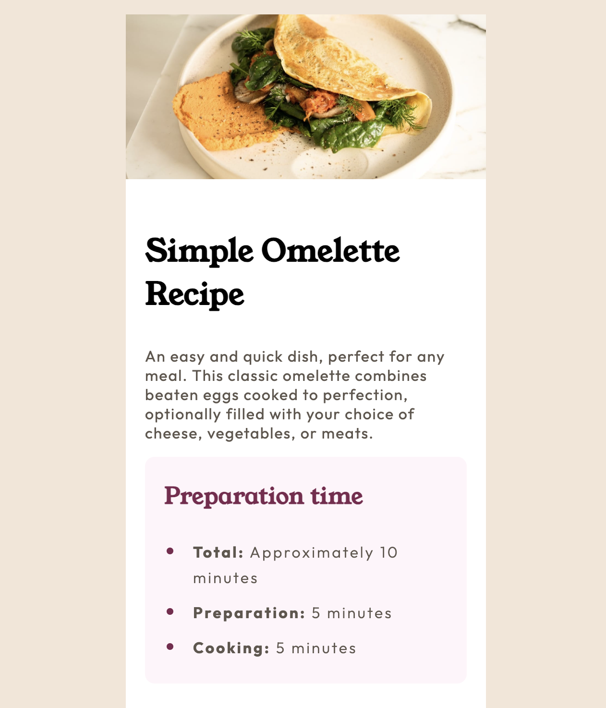
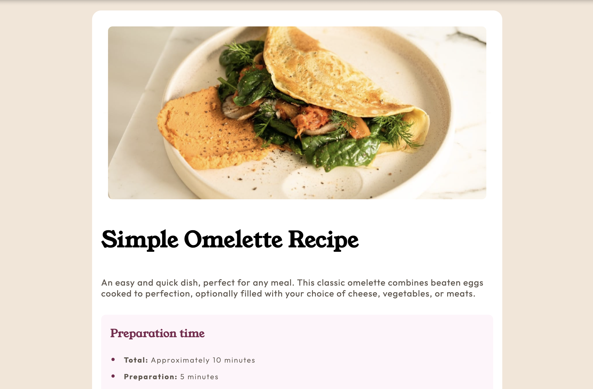

# Frontend Mentor - Recipe page solution

This is a solution to the [Recipe page challenge on Frontend Mentor](https://www.frontendmentor.io/challenges/recipe-page-KiTsR8QQKm). Frontend Mentor challenges help you improve your coding skills by building realistic projects.

## Table of contents

- [Overview](#overview)
  - [The challenge](#the-challenge)
  - [Screenshot](#screenshot)
  - [Links](#links)
- [My process](#my-process)
  - [Built with](#built-with)
  - [What I learned](#what-i-learned)
  - [Continued development](#continued-development)
  - [Useful resources](#useful-resources)
- [Author](#author)

## Overview

### Screenshot




### Links

- Solution URL: [Add solution URL here](https://your-solution-url.com)
- Live Site URL: [Add live site URL here](https://your-live-site-url.com)

## My process

### Built with

- Semantic HTML5 markup
- CSS custom properties
- Flexbox
- CSS Grid
- Mobile-first workflow

### What I learned

I learned how to add internal border radius on a box/div.

To see how you can add code snippets, see below:

```.image {
    background: radial-gradient(circle at 0 100%, white 14px, white 15px),
      radial-gradient(circle at 100% 100%, white 14px, white 15px),
      radial-gradient(circle at 100% 0, white 14px, white 15px),
      radial-gradient(circle at 0 0, white 14px, white 15px);

    background-position: bottom left, bottom right, top right, top left;
    background-size: 50% 50%;
    background-repeat: no-repeat;

    padding: 10px;
  }
```

### Continued development

I'll now move on to create full page designs and build full page websites.

### Useful resources

- [ resource 1](https://stackoverflow.com/questions/18518179/css-how-to-round-box-corners-inside) - This helped me add the internal border inside my image div for the desktop design. I really liked this pattern and will use it going forward.

## Author

- Website - [Chikezie Benson](https://www.your-site.com)
- Frontend Mentor - [@Benappy](https://www.frontendmentor.io/profile/benappy)
- Twitter - [@chikeziebenson](https://www.twitter.com/chikeziebenson)
